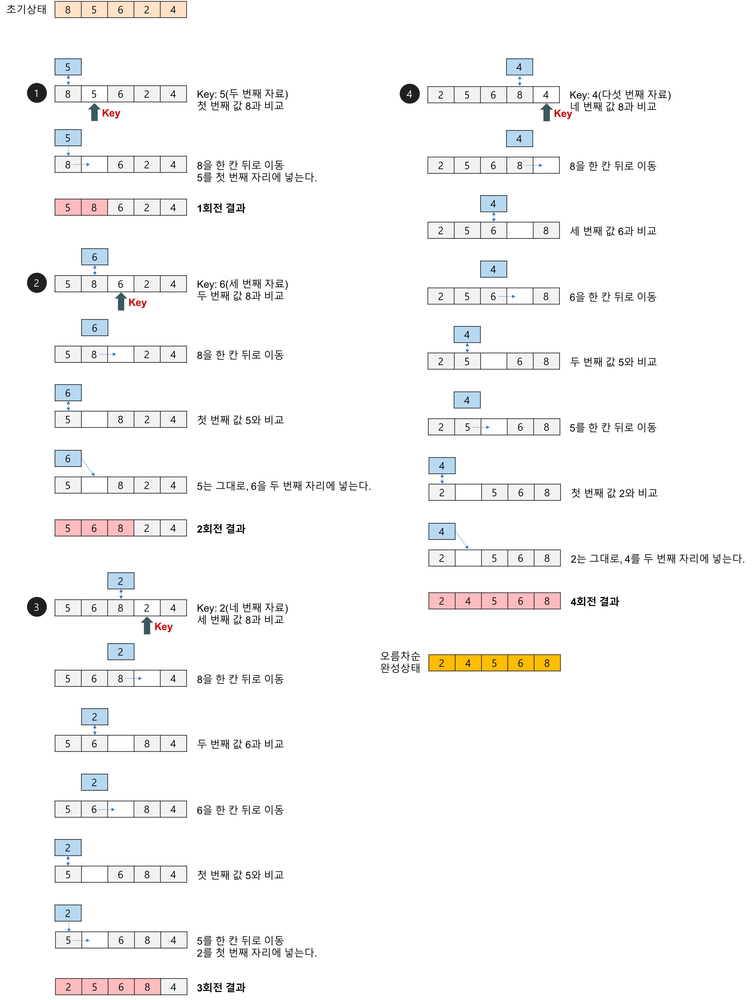

### Insertion sort
#### Abstract
- Insert sort는 Select sort와 유사하지만 좀 더 효율적인 알고리즘이다.
- Insertion Sort는 2번째 원소부터 시작하여 그 앞(왼쪽)의 원소들과 비교하여 삽입할 위치를 지정한 후, 원소를 뒤로 옮기고 지정된 자리에 자료를 삽입 하여 정렬하는 알고리즘이다.

#### Process
1. 두번째 위치(index)값을 temp에 저장
2. temp와 이전 원소들을 비교하며 삽입한다.
3. 1번으로 돌아가 다음위치값을 temp에 저장하고 반복한다.

#### Code
코드는 insert_sort.js 파일을 참고하면된다.

#### 사진으로 이해하는 삽입 정렬

#### 시간 복잡도 & 공간 복잡도
 - 시간복잡도
    - 최악의 경우(역으로 정렬되어 있을 경우) Selection Sort와 마찬가지로, (n-1) + (n-2) + .... + 2 + 1 => n(n-1)/2 즉, O(n^2) 이다.
    - 모두 정렬이 되어있는 경우 한번 밖에 비교하지 않기에 O(n)이다.
    - 최선의 경우는 O(n) 의 시간복잡도를 갖고, 평균과 최악의 경우 O(n^2) 의 시간복잡도를 갖게 된다.
 - 공간 복잡도
   - 주어진 배열 안에서 교환(swap)을 통해, 정렬이 수행되므로 O(n) 이다.

#### 장단점

- 장점
  - 구현이 매우 간단하고 소스코드가 직관적이다.
  - 대부분의 원소가 이미 정렬되어 있는 경우, 매우 효율적일 수 있다.
  - 정해진 배열 내부에서 교환하는 형식이라 다른 메모리가 필요하지 않다. (제자리 정렬)
  - 안정 정렬이다. 
    - 안정정렬이란 중복된 값의 경우 입력 순서와 동일하게 유지해서 정렬을 하는것을 말함.
  - Selection Sort나 Bubble Sort과 같은 O(n^2) 알고리즘에 비교하여 상대적으로 빠르다.
- 단점
  - 평균과 최악의 시간복잡도가 O(n^2)으로 비효율적이다.
  - Bubble Sort와 Selection Sort와 마찬가지로, 배열의 길이가 길어질수록 비효율적이다.

출처 : https://gyoogle.dev/blog/algorithm/Insertion%20Sort.html